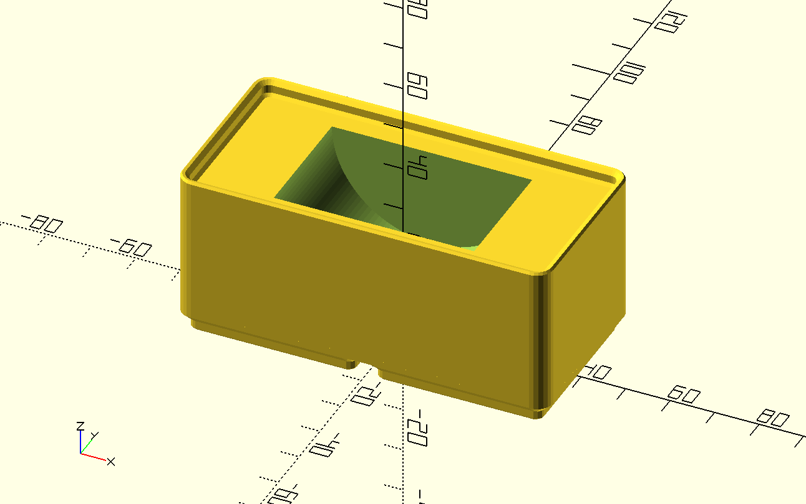
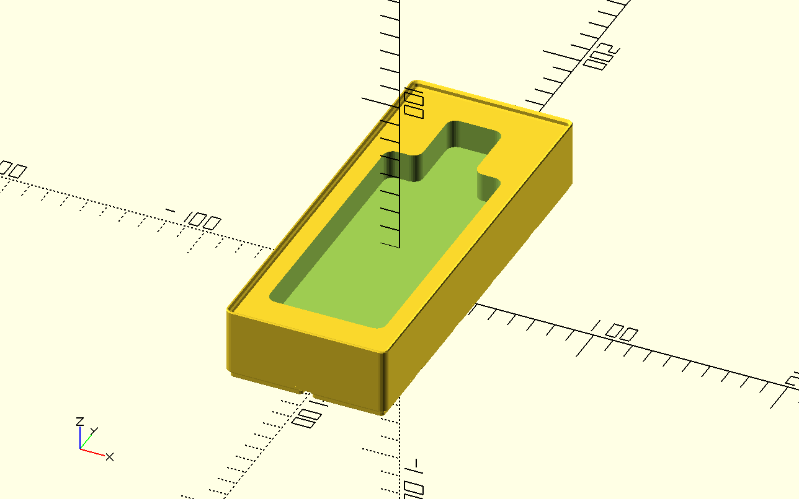

# Gridfinity Couleur

Specialized bins for holding German [fraternity paraphernalia](https://en.wikipedia.org/wiki/Couleur).

## Bierband

Hält ein aufgerolltes Band. Ideal zur Lagerung des Burschen- und Fuxenbandes.

## Zipfel

Halterung für einen Zipfel, mit Auskerbung für den Zipfelhalter und Platz für mehrere Zipfel.
